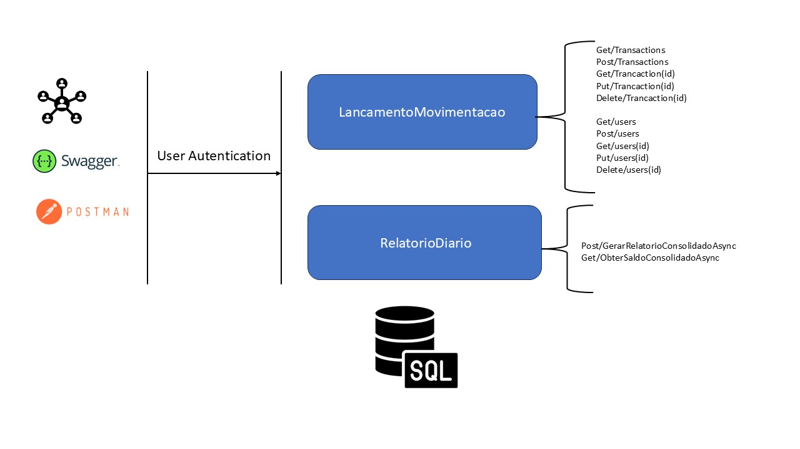

## Descrição
O **CashFlowManagerEQS** é uma aplicação para gerenciar o fluxo de caixa de um comerciante, permitindo a criação de lançamentos financeiros (débitos e créditos) e gerando um relatório consolidado de saldo diário.

## Tecnologias Utilizadas
- **ASP.NET Core MVC**
- **Entity Framework Core**
- **SQL Server LocalDB**
- **Bootstrap (para estilização)**
- **JavaScript** para interações no front-end

## Instalação e Execução Local

### Pré-requisitos:
- .NET 6.0 SDK ou superior instalado.
- SQL Server LocalDB instalado.

### Passos para execução local:

1. Clone este repositório:
   ```bash
   git clone https://github.com/eduardoquelhas/CashFlowManagerEQS.git

# CashFlowManagerEQS

## Mapeamento de Domínios Funcionais e Capacidades de Negócio

### Domínios Funcionais:

- **Controle de Lançamentos**:
  - Registro de transações financeiras (créditos e débitos).
  - Validação de dados de lançamentos.

- **Consolidação Diária**:
  - Geração de relatórios de saldo diário consolidado com base nos lançamentos.

### Capacidades de Negócio:

- **Registro de Transações**: Permite ao comerciante registrar todas as movimentações financeiras.
- **Geração de Relatórios**: Exibe um relatório de saldo diário consolidado para fácil visualização das finanças.

---

## Refinamento do Levantamento de Requisitos Funcionais e Não Funcionais

### Requisitos Funcionais:

- Inserir lançamentos de débitos e créditos.
- Gerar um relatório de saldo consolidado para o dia.
- Visualizar relatórios de dias anteriores.

### Requisitos Não Funcionais:

- **Disponibilidade**: O sistema de controle de lançamentos deve funcionar mesmo que o sistema de consolidação esteja temporariamente indisponível.
- **Escalabilidade**: O sistema deve suportar até 50 requisições por segundo, com uma taxa de falha de no máximo 5%.
- **Desempenho**: O tempo de geração dos relatórios deve ser quase em tempo real.
- **Segurança**: Proteção dos dados financeiros por meio de autenticação e autorização.

---

## Desenho da Solução Completo (Arquitetura Alvo)

A arquitetura da solução é baseada em microsserviços para garantir alta disponibilidade e escalabilidade. Os componentes principais são:

- **API de Lançamentos**: Para gerenciar os lançamentos financeiros.
- **API de Consolidação Diária**: Responsável pela geração de relatórios de saldo consolidado.
- **Banco de Dados SQL Server**: Para armazenar os lançamentos e dados financeiros.
- **Interface Web (ASP.NET Core MVC)**: Para permitir que os comerciantes façam lançamentos e visualizem os relatórios.

---

## Justificativa na Decisão/Escolha de Ferramentas/Tecnologias e Tipo de Arquitetura

### Ferramentas e Tecnologias:

- **ASP.NET Core MVC**: Framework robusto para construção de aplicações web com alta escalabilidade.
- **Entity Framework Core**: Para gerenciar o acesso ao banco de dados de forma eficiente.
- **SQL Server**: Banco de dados relacional confiável com suporte à alta disponibilidade.
- **JavaScript e Bootstrap**: Para melhorar a interatividade e usabilidade da interface.

### Tipo de Arquitetura:

A aplicação foi construída seguindo uma arquitetura de microsserviços, onde o controle de lançamentos e a consolidação diária são serviços independentes, possibilitando escalabilidade e independência de falhas.

---

## Testes

A aplicação inclui testes unitários e de integração desenvolvidos com **xUnit**. Os principais componentes testados incluem:

- **Serviço de Lançamentos**: Verificação da inserção, listagem e exclusão de lançamentos.
- **Serviço de Consolidação Diária**: Verificação da geração correta do relatório consolidado.
---
## Configuração do Banco de Dados

### Pré-requisitos:

- **.NET 6.0 SDK** ou superior.
- **SQL Server** (ou **SQL Server LocalDB**) instalado.

### Arquitetura: 


### Configuração do Banco de Dados:

1. Certifique-se de que você tem o **SQL Server** ou o **LocalDB** rodando em sua máquina.

2. Abra o arquivo `appsettings.json` e configure a string de conexão conforme necessário. Se estiver usando **LocalDB**, a string de conexão pode ser algo como:

   ```json
   {
     "ConnectionStrings": {
       "DefaultConnection": "Server=(localdb)\\MSSQLLocalDB;Database=CashFlowManagerEQS;Trusted_Connection=True;MultipleActiveResultSets=true"
     }
   }
   
```bash
dotnet ef migrations add InitialCreate
dotnet ef migrations add CreateLancamentosTable
dotnet ef database update
dotnet restore
dotnet run

Acesse a aplicação no navegador em http://localhost:5000
--
### Como executar os testes:

Para rodar os testes localmente, utilize o seguinte comando:

```bash
dotnet test
